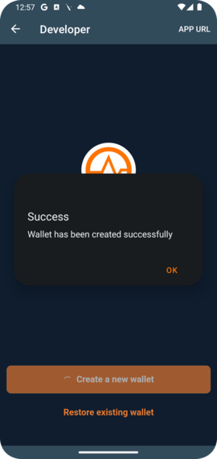
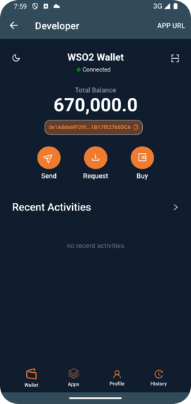
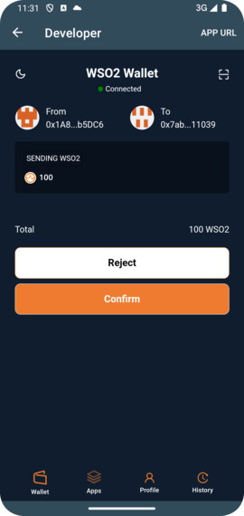
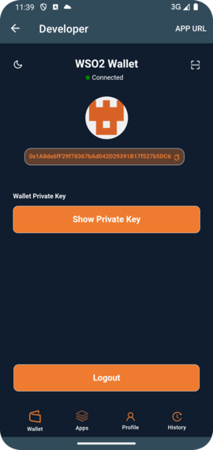
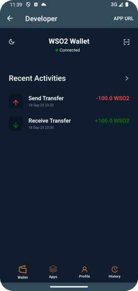

# WSO2 Wallet User Guide

Welcome to the WSO2 Wallet user guide. This guide will walk you through accessing, creating, and managing your crypto wallet. The WSO2 Wallet software is a private entity application, which allows users to interact and transfer their native currency, WSO2 coins, within a private blockchain environment.

## Table of Contents

- [WSO2 Wallet User Guide](#wso2-wallet-user-guide)
  - [Table of Contents](#table-of-contents)
    - [1. Accessing the Software ](#1-accessing-the-software-)
    - [2. Creating a Wallet ](#2-creating-a-wallet-)
    - [3. Navigating the Main Screen ](#3-navigating-the-main-screen-)
    - [4. Transferring Coins ](#4-transferring-coins-)
    - [5. Accessing Your Profile ](#5-accessing-your-profile-)
    - [6. Wallet Recovery Phase ](#6-wallet-recovery-phase-)
    - [7. Transaction History ](#7-transaction-history-)

---

### 1. Accessing the Software 

To access the WSO2 Wallet:

1. Open the WSO2 internal mobile application.
2. Navigate to the section containing WSO2 Wallet.
3. Tap to open the WSO2 Wallet app.

---

### 2. Creating a Wallet 

Setting up a new wallet is a straightforward process:

1. On the welcome screen, tap the `Create a new wallet` button.
   > 
   > 
1. You will be presented with an intermediate screen showcasing your wallet address, private key, and passphrase.
1. It's essential to keep your private key and passphrase secure. Tap on the copy icons next to each to copy them.
1. Save both your private key and passphrase in a secure location. **Remember**: Losing these details means you lose access to your tokens.
   > 

---

### 3. Navigating the Main Screen 

After creating a wallet, you'll be directed to the main screen. Here's what to expect:

1. **Token Balance**: At the top, you can view your current WSO2 coin balance.
2. **Connectivity Status**: Below the balance, the wallet connectivity status with the blockchain is displayed.
3. **Transaction History**: At the bottom of the screen, you'll find a list of your most recent transactions.

> 

---

### 4. Transferring Coins 

Follow these steps to transfer WSO2 coins to another wallet:

1. From the main screen, tap the `Send` button.
2. Enter the recipient's wallet address in the provided field.
3. Input the amount of WSO2 coins you wish to send.
4. Review the details and tap the `Confirm` button.
5. Wait for a confirmation message indicating the transaction was successful.
6. You can seed the recent transaction in the transaction history ib the main screen.
   > 
   > 
   > 
   > 

---

### 5. Accessing Your Profile 

To view your wallet details and log out:

1. Tap the `Profile` button on the bottom navigation.
2. Here, you can view your private key and wallet address. Remember never to share your private key with anyone.
3. To log out from the WSO2 Wallet app, tap the `Logout` button.

> 

---

### 6. Wallet Recovery Phase 

If you ever lose access to your WSO2 Wallet, don't panic. The Wallet Recovery Phase feature allows you to regain access using your unique 12-word passphrase. Here's how to use it:

1. From the welcome screen, tap on `Recover existing wallet`.
2. Enter your 12-word passphrase into the respective fields, ensuring the words are in the correct sequence.
3. Once entered, tap on `Confirm`.
4. You'll be directed to an intermediate review page, where you can see your wallet address and private key. Ensure all details appear as expected.
   If everything looks accurate, tap `Continue`.
5. You will be navigated to the main screen, showcasing your funds.

> 
> 
> 
> 

**Remember, your 12-word passphrase is crucial for wallet recovery, so keep it safe and confidential.**

### 7. Transaction History 

Keeping track of your transactions is made easy with the Transaction History feature:

1. From the main screen, tap on the Transaction History button in the bottom navigation.

- This page will display your transactions from the last 4 hours.
  Each transaction entry will show details such as:
  - Transaction type (Send/Receive)
  - Amount of WSO2 coins transacted
  - Timestamp of the transaction

> 

> **Stay informed of your recent activity and always be aware of your incoming and outgoing transactions.**

Thank you for choosing WSO2 Wallet. If you encounter any issues or have further questions, please contact our support team.
