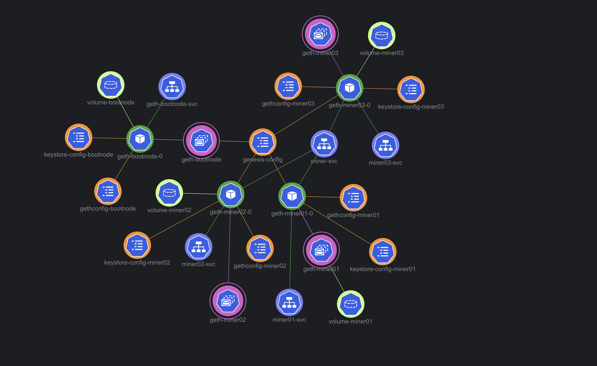
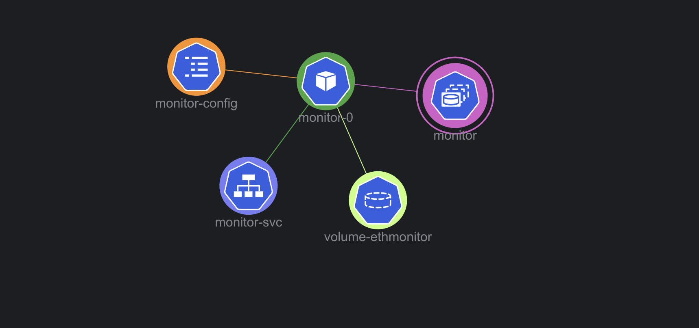

# Project Documentation

## Project Overview

This project aims to deploy a Proof-of-Authority (PoA) blockchain network onto a Kubernetes cluster. The blockchain network comprises 1 boot node and 3 miner nodes. This network is connected with a separate monitoring application which provides insights into the health status of the blockchain network.

## Architecture

The architecture consists of several key components, including:

1. Minikube: This is the local Kubernetes cluster where all nodes and services run.

2. Nodes: This includes 1 boot node and 3 miner nodes.

3. Services: Each node exposes RPC and P2P services.

4. Load Balancer: Distributes incoming requests to miner nodes to prevent overloading.

5. Persistent Volume: Ensures data persistence by storing blockchain data.

Here is a diagram illustrating the architecture of the deployment:

This diagram shows the deployed pods, their connections to services and storage, and how they interact within the Kubernetes cluster.

**Monitor App:** This separate pod within the Kubernetes cluster monitors and provides health status and other operational metrics of the blockchain network.

Here is a diagram illustrating the monitor application:

This diagram shows how the monitor application fits into the overall architecture, how it interacts with other components in the system, and the flow of monitoring data.

## Nodes

The boot node is responsible for the creation of the blockchain network and sets the initial configuration (e.g., chain ID, block time).

The miner nodes are the processing units of the blockchain network. They validate transactions and add them to the blockchain by mining new blocks. Each miner node exposes two services:

- RPC Service: This is the interface for interacting with the blockchain. It is used to deploy smart contracts, make transactions, and perform other interactions with the blockchain.

- P2P Service: This enables peer-to-peer communication between nodes in the blockchain network. It is used to broadcast new transactions and blocks to all nodes in the network.

## Load Balancer

The load balancer ensures that no single node gets overwhelmed with requests by evenly distributing incoming requests to miner nodes. This ensures high availability and reliability in the network by preventing any single point of failure.

## Persistent Volume

To ensure the blockchain data is not lost when the pods restart, the blockchain data from each miner node is stored in a Persistent Volume.

## Monitor App

The Monitor App is a separate application running within the Kubernetes cluster that provides insights into the health and performance of the blockchain network.

## Setup & Deployment

## Environment Variables

The environment.yaml file contains the configuration for your deployment. It includes details such as the chain ID, difficulty level, gas limit, and more. This allows you to easily change these settings without modifying the main codebase.

## Step-by-Step Deployment

1. Start your Minikube local cluster by running `minikube start`.

2. Ensure you have Helm installed. Helm is a package manager for Kubernetes that allows you to manage applications through yaml configuration files. If not, install Helm.

3. Convert the ERB templates to YAML files using the `erb` command, e.g., `erb genesis.json.erb > genesis.json.yaml`.

4. Deploy the nodes and services using `kubectl apply -f <file.yaml>`, starting with the boot node and following with the miner nodes.

5. After all nodes are up and running, deploy the load balancer using `kubectl apply -f 05_load_balancers.yaml`.

6. Lastly, deploy the monitoring app using `kubectl apply -f 04_monitor.yaml`.

Your blockchain network is now up and running on your Minikube cluster.

## File Structure and Responsibilities

1. `environment.yaml`: This file serves as the main configuration file for your blockchain deployment. It contains important details like the number of nodes, details of each node (like node type, node name, etc.), and any global settings. The values in this file are interpolated into the other template files at deployment time.

2. `erb/00_claims.yaml.erb`: This ERB (Embedded Ruby) template defines the Kubernetes PersistentVolumeClaims, which are used to manage persistent storage for your services. PersistentVolumeClaims are a way for users to "claim" durable storage (like a disk) without knowing the details of the particular cloud environment.

3. `erb/01_common-config.yaml.erb`: This ERB template is used to create a common ConfigMap in Kubernetes. A ConfigMap is a Kubernetes object used to store non-confidential data in key-value pairs. It's likely to contain configuration shared across services, such as environmental configs.

4. `erb/02_bootnodes.yaml.erb`: This ERB template is used to create the configuration for the bootnodes in your blockchain network. Bootnodes are essential to the Ethereum network as they help new nodes to find and join the network.

5. `erb/03_nodes.yaml.erb`: This ERB template creates the configuration for miner nodes. In a Proof of Authority Ethereum network, these are the nodes that validate transactions and blocks.

6. `erb/04_monitor.yaml.erb`: This ERB template sets up the monitor service. This service provides a user interface where you can see the status of your Ethereum network and nodes.

7. `erb/05_load_balancers.yaml.erb`: This ERB template defines the Kubernetes Service acting as a load balancer for your miner nodes. This allows incoming requests to be spread across your miner nodes.

8. `erb/genesis.json.erb`: This ERB template provides the configuration for your Ethereum blockchain's genesis block. The genesis block is the first block in the blockchain, and its configuration can include things like the initial difficulty, the gas limit, and the initial list of signers in a PoA network.

9. `node/node.toml.erb`: This ERB template provides the configuration for a Geth node. It can include settings like the network ID, the gas price, and whether the node should run in mining mode.

10. `blockchainit`: This is likely a script or executable file that processes the ERB templates and applies them to your Kubernetes cluster, using the values from environment.yaml.

11. `start_in_minikube.sh`: This shell script helps to automate the deployment of your Ethereum network in a local Minikube environment. Minikube is a tool that allows you to run Kubernetes locally.

## Conclusion

This project provides a robust and flexible PoA blockchain network that can be deployed locally on a Minikube Kubernetes cluster. The usage of environment variables for configuration and ERB templates for Kubernetes resources makes the deployment process efficient and easily adjustable. Additionally, the integrated monitoring app provides insights into the network's health and performance, allowing for proactive maintenance and troubleshooting.
